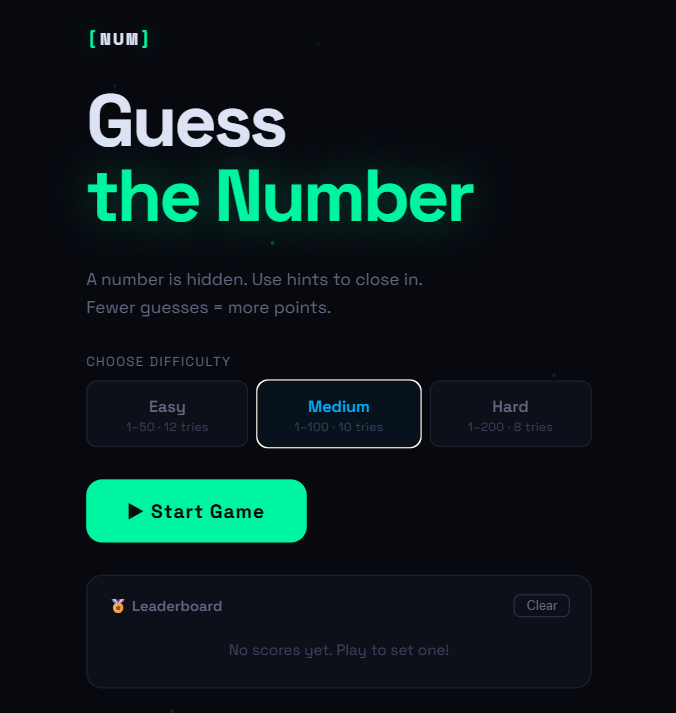
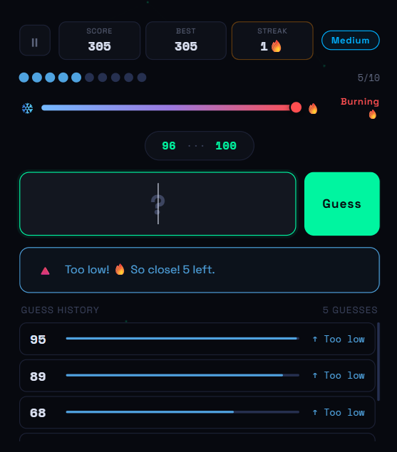
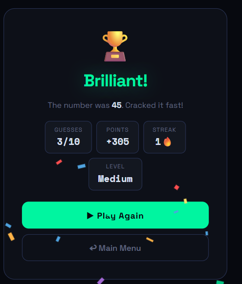

# 🎮 NUMGAME — Guess the Number

A polished, feature-rich browser-based number guessing game built with pure HTML, CSS, and JavaScript. No frameworks, no dependencies — just open `index.html` and play.

---

## 📁 Project Structure

```
Number Guessing Game/
├── README.md
├── Index.html
├── script.js
├── style.css
└── Screenshots/
    ├── start.png
    ├── gameplay.png
    └── win.png
```
## 📸 Screenshots

### Start Screen


### Gameplay


### Winning Screen

---

## ✨ Features

### 🎯 Core Gameplay
- A secret number is randomly generated based on the selected difficulty
- Player guesses the number within a limited number of tries
- After each guess, hints narrow down the search range in real time

### 🌡️ Hot-Cold Meter
- A visual gradient bar slides from ❄️ cold (far away) to 🔥 hot (very close)
- Updates on every guess so players can feel proximity intuitively

### 🎚️ Difficulty Levels

| Level  | Range  | Tries | Base Score |
|--------|--------|-------|------------|
| Easy   | 1–50   | 12    | 100 pts    |
| Medium | 1–100  | 10    | 200 pts    |
| Hard   | 1–200  | 8     | 400 pts    |

### 🏆 Score & Streak System
- Score = Base points + (tries remaining × 15) + (streak × 25)
- Win streak multiplies your bonus — keep it alive!
- Session best score tracked and displayed live

### 🏅 Leaderboard (localStorage)
- Top scores are saved to `localStorage` and persist across sessions
- Displayed on the Start Screen with gold/silver/bronze ranks
- Clearable with one click

### 🔊 Sound Effects
- Distinct tones for: guess click, too high, too low, win (ascending chord), lose (descending)
- Built with the Web Audio API — zero audio files needed

### 🎉 Animations
- Confetti burst on win
- Shake animation on invalid input
- Score pop when points are earned
- Sliding dot tracker per guess (color-coded: red = too high, blue = too low, green = win)
- Ambient particle network background

### 📱 Screens
1. **Start Screen** — Difficulty picker + leaderboard
2. **Game Screen** — Live gameplay with all indicators
3. **Pause Screen** — Resume or quit to menu
4. **End Screen** — Win/loss result, stats breakdown, play again

---

## 🚀 How to Run

No server, no install needed.

```bash
# Just open in any browser:
open index.html
```

Or drag `index.html` into your browser window.

---

## 🕹️ How to Play

1. Pick a difficulty on the Start Screen
2. Press **▶ Start Game**
3. Type a number and press **Guess** (or hit `Enter`)
4. Follow the hot-cold meter and narrowing range to zero in
5. Guess the number before your tries run out!

**Scoring tip:** Solve it in fewer guesses and maintain a win streak to maximize points.

---

## 🛠️ Tech Stack

| Layer      | Technology                          |
|------------|-------------------------------------|
| Markup     | HTML5 (semantic, accessible)        |
| Styling    | CSS3 (custom properties, grid, flex)|
| Logic      | Vanilla JavaScript (ES6+)           |
| Audio      | Web Audio API                       |
| Storage    | localStorage                        |
| Fonts      | Google Fonts — Space Grotesk + Space Mono |

---

## 📐 Design System

| Token        | Value             | Usage                  |
|--------------|-------------------|------------------------|
| `--neon`     | `#00f5a0`         | Accent, win states     |
| `--hot`      | `#ff4e50`         | Too high, errors       |
| `--cool`     | `#4fa3e0`         | Too low                |
| `--bg`       | `#07090f`         | Page background        |
| `--surface`  | `#0d1018`         | Cards & panels         |
| Display font | Space Grotesk 700 | Headings & buttons     |
| Mono font    | Space Mono 700    | Numbers & scores       |

---

## 🌐 Browser Support

Works in all modern browsers — Chrome, Firefox, Safari, Edge.
Mobile responsive down to 360px width.

---

## 🔮 Possible Future Improvements

- Multiplayer / challenge-a-friend mode
- Daily challenge with a fixed seed
- Timed mode with countdown pressure
- Player name input for personalized leaderboard entries
- PWA support for offline play + home screen install

---

## 👩‍💻 Author

Built by **Lavanya Agrawal**
B.Tech CSE · UPES Dehradun

> *"Fewer guesses, more glory."*
